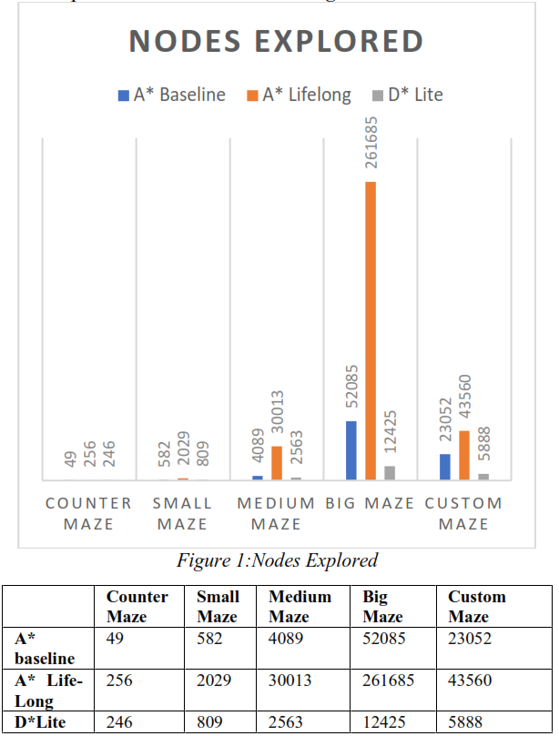
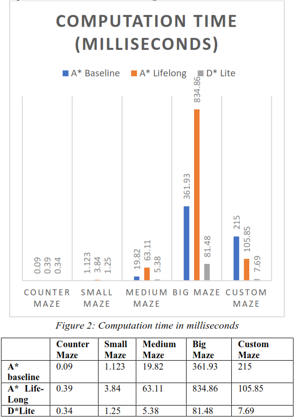
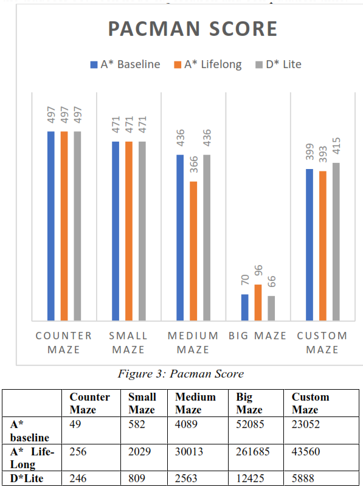

# Lifelong Planning Pacman World
## Description
- Implementation based on the research paper **[D*Lite](DStar-Lite.pdf)** by <i>Sven Koenig and Maxim Likhachev</i>.
- The details about the project can be found in the **[Project-Description](Project-Description.pdf)**.
- The main working code can be found in **[search.py](search/search.py)** and **[searchAgents.py](search/searchAgents.py)**.
- The different layouts for testing can be found in **[layouts](search/layouts)**.

## Introduction
In computer science a search algorithm is any algorithm which is used to solve the search problem namely to retrieve information which is stored within some data structure or calculated in a search space of a problem domain. There are many methodologies to implement search algorithms and, in this project, we decided to compare the performance of 3 of them which are A* baseline, A* Life Long and D* Lite.  A* baseline is a type of informed search algorithm which is basically a combination of the cost to reach the nodes[g(n)] and the cost to reach the goal from the node. [h(n)]
i.e. 𝑓(𝑛)  =  𝑔(𝑛)  +  ℎ(𝑛)  

A* baseline search algorithm tries to minimize the total estimated cost of the solution. A* search is both complete and optimal. In A* the tree search is optimal if h(n) is admissible. The graph search is optimal if h(n) is consistent. In A* if h(n) is consistent the value of f(n) along any path are nondecreasing.

When a node in A* is selected for expansion it means that the optimal path to that node is already found. f(n) is the true cost of the goal node and all the other nodes expanded will have at least that cost. If C* is the cost of optimal solution path, then A* will expand all the nodes with f(n) < C* and it will also expand some more nodes around the goal node before fixing the goal node. The time complexity of A* is dependent on the heuristic and in the worst case of an unbounded search space is exponential in the depth of the solution which is b<sup>d</sup> where b is the branching factor and d is the depth. When A* assumes infinite state space, the algorithm will not terminate and run indefinitely.

According to Koenig & Likhachev Life-Long A* is an algorithm that generalizes both DynamicSWSF-FP and A*. It is due to this approach that it uses two different techniques to reduce its planning time. A* Life Long is an incremental version of A* algorithm. It is specifically applicable to finite graph search problems with known graphs whose edge cost increases or decreases over time period. LPA* always defines the shortest path from a given start vertex s start to any predecessor s’ which minimizes g(s’) + c(s’,s) until the start state is reached.  Life-Long A* does not make all the vertices locally consistent after some edge costs have changed but it uses the heuristics and focuses only on the g – calues that are relevant for computing a shortest path and updates them. LifeLong A* knows both the topology of the graph as well as the edge cost currently. In Life-Long A* g*(s) is considered to be the distance from the start state to the current state which correspond to the g-values of a A* search. In A* Life-Long similar to A* heuristics is used to calculate the distance from the current state to the goal state and the heuristic should be consistent. In Life-Long A* a second set of values called the rhs are also maintained which are one-step lookahead values based on the g-values and thus are potentially more informed as compared to the g-values.

D* Lite algorithm is developed from A* Life-Long algorithm that repeatedly determines shortest paths between the current vertex the agent is in and the goal vertex as the cost of the edge in the graph changes with the movement of the agent towards the goal vertex. The D* Lite has no assumptions about how the cost of the edge changes. It is used to solve the goal directed navigation problems in the unknown terrain. In D* Lite algorithm we first need to switch the search direction as compared to Life-Long A*. unlike Life-Long A* the D* Lite searches from the goal vertex to the start vertex and thus its g- values are estimates of the goal distances. D* Lite is basically A* Life-Long in which the start and the goal vertex are exchanged, and all the edges are reversed. Unlike A* Life- Long D* Lite uses only one tie breaking criterion when the priorities are compared. After computation one can follow the shortest path from the start state to the goal state by always moving from the current vertex s to any successor s’ that minimizes the value for c(s, s’) + g(s’) until the goal is reached. In D* Lite the heuristics are derived by relaxing the search problems. D* Lite uses a method derived from D* to avoid the reordering of the priority queue. To avoid re-ordering, we maintain the variable and incrementally increase its value when robot moves towards the goal state. As the terrain gets larger, D* lite algorithm expands fewer nodes than A* and LPA* algorithms while being far more efficient than the both of them. One of its main uses is in the domain of greedy mapping.

## Working Testing Requirements
- **Python:** v2.7+
- **Operating System:** Ubuntu 18.04 LTS

## Command Line Arguments
Please use the commands below on Linux terminal to run the program.

### Layout Type : bigCornerscustom

- **A* Algorithm**
```
python pacman.py -l bigCornerscustom -z .5 -p SearchAgent -a fn=abase,heuristic=manhattanHeuristic
python pacman.py -l bigMaze -z .5 -p SearchAgent -a fn=abase,heuristic=manhattanHeuristic
python pacman.py -l mediumMaze -z .5 -p SearchAgent -a fn=abase,heuristic=manhattanHeuristic
python pacman.py -l smallMaze -z .5 -p SearchAgent -a fn=abase,heuristic=manhattanHeuristic
python pacman.py -l contoursMaze -z .5 -p SearchAgent -a fn=abase,heuristic=manhattanHeuristic
```

- **A* Lifelong Algorithm**
```
python pacman.py -l bigCornerscustom -z .5 -p SearchAgent -a fn=astar,heuristic=manhattanHeuristic
python pacman.py -l bigMaze -z .5 -p SearchAgent -a fn=astar,heuristic=manhattanHeuristic
python pacman.py -l mediumMaze -z .5 -p SearchAgent -a fn=astar,heuristic=manhattanHeuristic
python pacman.py -l smallMaze -z .5 -p SearchAgent -a fn=astar,heuristic=manhattanHeuristic
python pacman.py -l contoursMaze -z .5 -p SearchAgent -a fn=astar,heuristic=manhattanHeuristic
```

- **D* lite Algorithm**
```
python pacman.py -l bigCornerscustom -z .5 -p SearchAgent -a fn=dstar,heuristic=manhattanHeuristic
python pacman.py -l bigMaze -z .5 -p SearchAgent -a fn=dstar,heuristic=manhattanHeuristic
python pacman.py -l mediumMaze -z .5 -p SearchAgent -a fn=dstar,heuristic=manhattanHeuristic
python pacman.py -l smallMaze -z .5 -p SearchAgent -a fn=dstar,heuristic=manhattanHeuristic
python pacman.py -l contoursMaze -z .5 -p SearchAgent -a fn=dstar,heuristic=manhattanHeuristic
```


## Results
For comparison of the search algorithms we choose 5 different
layouts namely: counterMaze, smallMaze, mediumMaze,
bigMaze and customMaze. The layouts are different based on
their complexity and size. The counterMaze is a basic open
layout with just a pacman and a food palette whereas the
complexity and the size of these mazes are increased in the
small, medium and big mazes, respectively. The custom maze
is like the big maze in terms of its size but is a slightly more
complex than the others with changes to the pacman start
location and the goal food palette.
The findings of these experiments in different graphs are judged
on different criteria which reflect the performance, the
optimality and the efficiency of these algorithms. We use
number of nodes expanded to find the computation needed for
each of the algorithms to solve the maze. The score obtained
tells us on the efficiency of the algorithm and give us insights
on the tradeoff between computation time and better routing of
the path. The time complexity tells us about the overall time
needed for algorithm execution. All these together help us
understand the pros and the cons of these algorithms and better
understand their use case in practicality.
Our findings are as follows:

### **a. Number of Nodes Explored**
<br>




We can say that the nodes explored by A* baseline for a simple
and less complex maze will be similar or better than the D* lite
algorithm. With a higher complexity medium maze, the
performance of the D* lite improves in terms of the nodes
explored which reaches a stage of a massive improvement with
the introduction of big and custom big maze.
<br>
<br>

### **b. Computation Time**
<br>




For the analysis of computation time of the algorithms we used
a machine with 8 gigabytes of RAM, a 64-bit 4 core intel 6200U
CPU, Intel HD 520 graphics running on Ubuntu 18.04 LTS.
According to our observations, given the optimality of D* lite
as seen before in terms of the nodes explored we can say that
the computation time of D* lite is a lot less when compared to
A* base and A* lifelong for complex mazes but shows similar
computation time for simple mazes. It was also observed that
the computational time of A* lifelong and A* baseline
increased drastically as compared to D* lite.
<br>
<br>

### **c. Pacman Score**
The pacman scores were calculated by the project environment
that was provided to us. Based on the results we can say that
when the mazes were simple and less complex the pacman scores were same for all the 3 algorithms but as the complexity
increased the A* baseline and the D* lite algorithms
outperformed the A* lifelong algorithm by a small margin
generally. The pacman scores however does not give us a
proper quantitative analysis of the algorithm but only portray
the tradeoff between node exploration and computation time. 
<br>




From the above-mentioned results, we come to a final result 
that A* lifelong algorithm results even though similar for
simple tasks are not as good as A* baseline algorithm for
complex mazes so the improved implementation of the D* lite
algorithm as mentioned in the paper out outperformed both the
other algorithms in a more complex environment while having
minimum to no tradeoff between its performance. The D* lite
algorithm showed improved results, better to similar scores, a
drastically reduced computation time and far less nodes
explored compared.
<br>
<br>

## Conclusion
We can conclude that the number of nodes explored, and the
computation time improves for the D* Lite algorithm as the
complexity of the environment increases. We can observe that
the number of nodes explored improves drastically when we
search for the shortest path from the goal state in D* Lite as
compared to that from the start state in A* Life-Long. The
computation time required by the D* Lite algorithm is also less
as compared to the A* Baseline and A* Life-Long algorithms
for complex environment. The score obtained by the pacman
was same for all the algorithms till the environment was simple and as the complexity increases the scores obtained by the
pacman was higher for D* Lite and A* baseline as compared to
A* Life-Long. From all the results derived in this environment
we can conclude that D* Lite performs better as compared to
A* baseline and A* Life-Long with the increase in complexity
of the environment. In order to use this D* Lite algorithm for the
environments having multiple food pallets and where ghosts are
present, we need to extend the logic. 